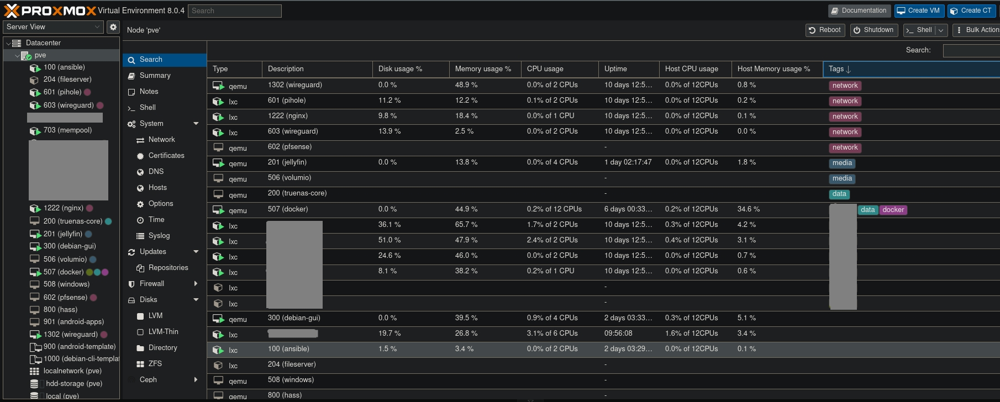

# Ansible Configuration and Playbooks Repository



## Introduction

Welcome to my Ansible Configuration and Playbooks repository. In addition to general system administration tasks, this repository serves as a hub for deploying and managing containers in my Proxmox cluster. As a Solutions Architect with a strong focus on DevOps, these playbooks are designed to solve real-world challenges in modern, distributed systems.

## Features

- 🛠 System setup for LXC containers
- 🔒 SSH Key management
- 📦 Package management and system updates
- 💻 Custom shell configurations
- 📈 Monitoring and logging configurations
- 🔄 Parallel execution for managing many containers
- ⚡ Performance optimizations for routine tasks
- 🔍 Dynamic inventory via Proxmox API

## Requirements

- Ansible 2.x or higher
- SSH access to target nodes
- Linux-based control node
- Proxmox cluster access with API token

## Installation

1. Clone this repository:

```bash
git clone https://github.com/federicociro/ansible-plays.git
```

2. Set up environment variables:

```bash
cp env_template .env
# Edit .env with your Proxmox credentials
```

3. Install required collections:

```bash
ansible-galaxy collection install community.general
ansible-galaxy collection install ansible.utils
```

## Usage

### Using static inventory

```bash
ansible-playbook -i hosts playbooks/update-all.yml
```

### Using dynamic Proxmox inventory (recommended for containers)

```bash
source .env && ansible-playbook -i proxmox.yaml playbooks/update-all.yml
```

### Target specific container groups

```bash
source .env && ansible-playbook -i proxmox.yaml playbooks/update-all.yml --limit 'prod'
```

### Increase parallelism for faster execution

```bash
source .env && ansible-playbook -i proxmox.yaml playbooks/update-all.yml -f 30
```

## Optimizations

- Fact caching to reduce inventory processing time
- Parallel task execution with configurable batch sizes
- Async task execution for long-running operations
- OS-specific group handling for targeted operations
- APT caching to reduce bandwidth usage
- SSH pipelining and persistent connections

## Contributing

If you have suggestions or improvements, feel free to fork this repository and create a pull request.

## License

This project is licensed under the MIT License. See the [LICENSE](LICENSE) file for details.
